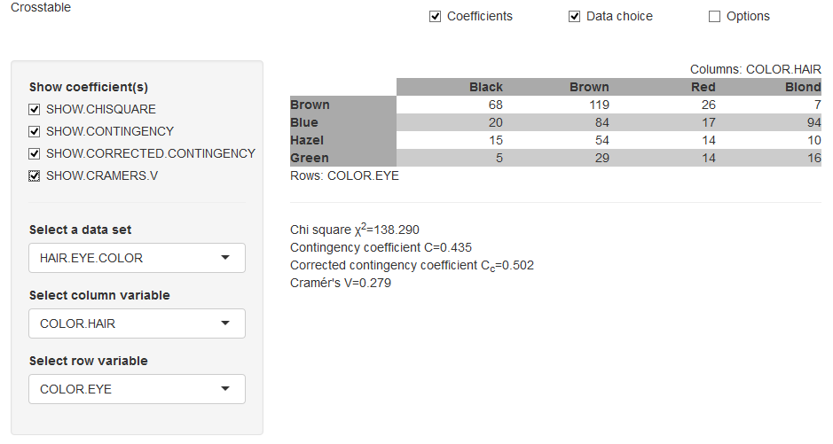

[](http://quantlet.de/index.php?p=info)

## [](http://quantlet.de/) **MMSTATcrosstable** [](http://quantlet.de/d3/ia)

```yaml

Name of QuantLet : MMSTATcrosstable

Published in : MMSTAT

Description : 'Computes a contingency table. Additionally, four different correlation measures can
be given: Chi-square, contingency correlation, corrected contingency correlation and Cramer''s V.
The user can interactively choose between variables of the data sets TITANIC and HAIR.EYE.COLOR.'

Keywords : 'contingency table, correlation, Chisquare, chi-square test discrete, parameter,
interactive, parametric'

See also : 'MVAcorrEyeHair, MVAcorrCar, MSECramervonMisestest, MMSTATtime_series_1, MMSTATlinreg,
MMSTATconfmean, MMSTATconfi_sigma, MMSTATassociation, MMSTAThelper_function'

Author : Sigbert Klinke

Code Editor : Yafei Xu

Input : MMSTAThelper_function

Output : Interactive shiny application

Datafiles : CARS.rds, DECATHLON.rds, USCRIME.rds

Example : 'Shows the contingency table and coefficients for the variables COLOR.HAIR and COLOR.EYE
of the data set HAIR.EYE.COLOR.'

```




### R Code:
```r
# ------------------------------------------------------------------------------
# Name of Quantlet: MMSTATcrosstable
# ------------------------------------------------------------------------------
# Published in:     MMSTAT
# ------------------------------------------------------------------------------
# Description:      Computes a contingency table. Additionally, four different 
#                   correlation measures can be given: Chi-square, contingency  correlation,
#                   corrected contingency correlation and Cramer's V.
#                   The user can interactively choose between variables of the data sets TITANIC
#                   and HAIR.EYE.COLOR.
# ------------------------------------------------------------------------------
# Keywords:         contingency table, correlation, Chisquare, chi-square test
#                   discrete,  parameter, interactive, parametric
# ------------------------------------------------------------------------------
# Usage:            MMSTAThelper_function
# ------------------------------------------------------------------------------
# output:           Interactive shiny application
# ------------------------------------------------------------------------------
# Example:          Shows the contingency table and coefficients for the variables COLOR.HAIR
#                   and COLOR.EYE of the data set HAIR.EYE.COLOR.
# ------------------------------------------------------------------------------
# See also:         MVAcorrEyeHair, MVAcorrCar, MSECramervonMisestest,
#                   MMSTATtime_series_1, MMSTATlinreg, MMSTATconfmean, 
#                   MMSTATconfi_sigma, MMSTATassociation, MMSTAThelper_function
# ------------------------------------------------------------------------------
# Author :          Sigbert Klinke
# ------------------------------------------------------------------------------
# Code Editor:      Yafei Xu
# ------------------------------------------------------------------------------
# Datafiles:        TITANIC.rds, HAIR.EYE.COLOR.rds
# ------------------------------------------------------------------------------

# please use "Esc" key to jump out of the Shiny app
rm(list = ls(all = TRUE))
graphics.off()

# please set working directory setwd('C:/...') 
# setwd('~/...')    # linux/mac os
# setwd('/Users/...') # windows

source("MMSTAThelper_function.r")

############################### SUBROUTINES ##################################
### server ###################################################################

mmstat$vartype = 'facvars'
mmstat.ui.elem("coeff", 'checkboxGroupInput',
               label    = gettext("Show coefficient(s)"),
               choices  = gettext(c("SHOW.CHISQUARE", "SHOW.CONTINGENCY", 
                                    "SHOW.CORRECTED.CONTINGENCY", 
                                    "SHOW.CRAMERS.V"), 
                                  "name"),
               value    = character())
mmstat.ui.elem("dataset", "dataSet",     
               choices  = mmstat.getDataNames("HAIR.EYE.COLOR", "TITANIC"))
mmstat.ui.elem("variableYSelect", "variable1", vartype = "factor", 
               label    = gettext("Select column variable"))
mmstat.ui.elem("variableXSelect",   "variable1",   vartype = "factor",
               label    = gettext("Select row variable"))
mmstat.ui.elem("cex", "fontSize")

server = shinyServer(function(input, output, session) {
  
  output$coeffUI           = renderUI({ mmstat.ui.call('coeff') })  
  output$datasetUI         = renderUI({ mmstat.ui.call('dataset') })
  output$cexUI             = renderUI({ mmstat.ui.call('cex')  })
  output$variableXSelectUI = renderUI({ mmstat.ui.call('variableXSelect') })
  output$variableYSelectUI = renderUI({ mmstat.ui.call('variableYSelect') })

  observe({
    inp = mmstat.getValues(NULL, dataset = input$dataset)
    updateSelectInput(session, "variableYSelect",
                      choices  = mmstat.getVarNames(inp$dataset, 'factor'),
                      selected = mmstat$dataset[[inp$dataset]]$facvars[1])
    updateSelectInput(session, "variableXSelect",
                      choices  = mmstat.getVarNames(inp$dataset, 'factor'),
                      selected = mmstat$dataset[[inp$dataset]]$facvars[2])
  })
  
  output$contingencyTable = renderText({
    inp   = mmstat.getValues(NULL, 
                             dataset         = input$dataset,
                             coeff           = input$coeff,
                             variableXSelect = input$variableXSelect,
                             variableYSelect = input$variableYSelect,
                             cex             = input$cex)
    varx  = mmstat.getVar(isolate(inp$dataset), varname = inp$variableXSelect)
    vary  = mmstat.getVar(isolate(inp$dataset), varname = inp$variableYSelect)
    tab   = table(varx$values, vary$values)
    vars  = c(gettext(vary$name), gettext(varx$name))
    lines = NULL
    chisq = chisq.test(tab)
    C     = sqrt(chisq$statistic/(chisq$statistic+sum(tab)))
    k     = min(nrow(tab), ncol(tab))
    V     = sqrt(chisq$statistic/sum(tab)/(k-1))
    for (i in seq(inp$coeff)) {
      if (inp$coeff[i] == "SHOW.CHISQUARE") {
        lines = c(lines, sprintf(gettext("Chi square &chi;<sup>2</sup>=%.3f"), 
                                 chisq$statistic))                
      }
      if (inp$coeff[i] == "SHOW.CONTINGENCY") {        
        lines = c(lines, sprintf(gettext("Contingency coefficient C=%.3f"), C))
      }
      if (inp$coeff[i] == "SHOW.CORRECTED.CONTINGENCY") {        
        lines = c(lines, sprintf(gettext("Corrected contingency 
                                         coefficient C<sub>c</sub>=%.3f"), 
                                 C*sqrt(k/(k-1))))
      }
      if (inp$coeff[i] == "SHOW.CRAMERS.V") {        
        lines = c(lines, sprintf(gettext("Cram&eacute;r\'s V=%.3f"), V))
      }
    } 
    HTML(htmlTable(tab, vars = vars, lines = lines, cex = inp$cex))    
  })
    
  output$logText = renderText({
    mmstat.getLog(session)
  })
})

############################### SUBROUTINES ##################################
### ui #######################################################################

ui = shinyUI(fluidPage(
  div(class = "navbar navbar-static-top",
      div(class = "navbar-inner", 
          fluidRow(column(6, div(class = "brand pull-left", 
                                 gettext("Crosstable"))),
                   column(2, checkboxInput("showcoeff", 
                                           gettext("Coefficients"), 
                                           FALSE)),
                   column(2, checkboxInput("showdata", 
                                           gettext("Data choice"), 
                                           TRUE)),
                   column(2, checkboxInput("showoptions", 
                                           gettext("Options"), 
                                           FALSE))))),
    
  sidebarLayout(
    sidebarPanel(
      conditionalPanel(
        condition = 'input.showcoeff',
        uiOutput("coeffUI")
      ),
      conditionalPanel(
        condition = 'input.showdata',
        hr(),
        uiOutput("datasetUI"),
        uiOutput("variableYSelectUI"),
        uiOutput("variableXSelectUI")
      ),
      conditionalPanel(
        condition = 'input.showoptions',
        hr(),
        uiOutput("cexUI")
      )
    ),
    mainPanel(htmlOutput("contingencyTable"))),

  htmlOutput("logText")  
))

############################### SUBROUTINES ##################################
### shinyApp #################################################################

shinyApp(ui = ui, server = server)

```
