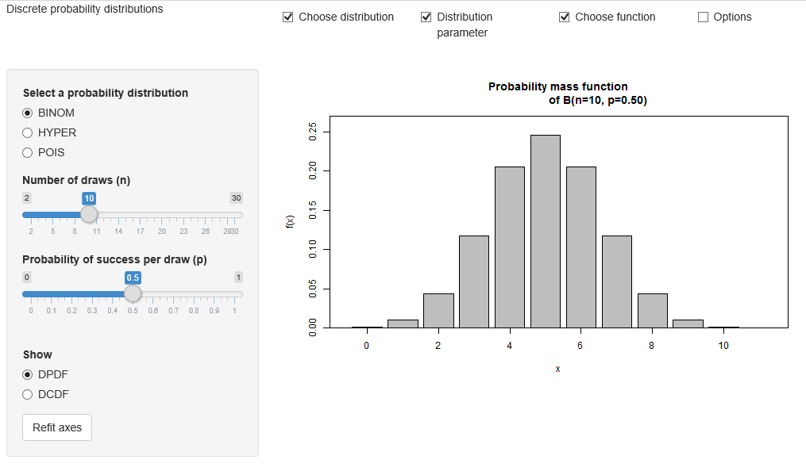

##  **MMSTATdistribution_binomial**

```yaml

Name of QuantLet : MMSTATdistribution_binomial

Published in : MMSTAT

Description : 'Produces an interactive interface to show the probability mass 
function (PDF) of the binomial distribution. The default settings produce a 
histogram of the binomial distribution with parameters n = 10 and
p = 0.5. The user can interactively choose a different 
number of draws (n) and a different probability of success per draw (p). 
The user can also choose to show the CDF of the binomial 
distribution with a step function. The user can choose two
other distributions: the hyper-geometric distribution and 
the Poisson distribution.'

Keywords : 'discrete, histogram, plot, poisson, binomial, 
data visualization, empirical, estimation, parameter, 
parametric, visualization, cdf, interactive, pdf'

See also : 'BCS_Hist1, BCS_Hist2, BCS_Binpdf, BCS_Binompdf, 
MMSTATtime_series_1, MMSTATlinreg, MMSTATconfmean, 
MMSTATconfi_sigma, MMSTATassociation, MMSTAThelper_function'

Author : Sigbert Klinke

Code Editor: Yafei Xu

Submitted : 

Input : MMSTAThelper_function

Output : Interactive shiny application
 
Datafiles : 

Example : 
- 'Shows the probaility mass function 
of the binomial distribution with number of draws (n = 10) and probability
of success per draw (p = 0.5) chosen from slide-bars. One can see the PDF
plotted as gray bins. '

```




```r

```
