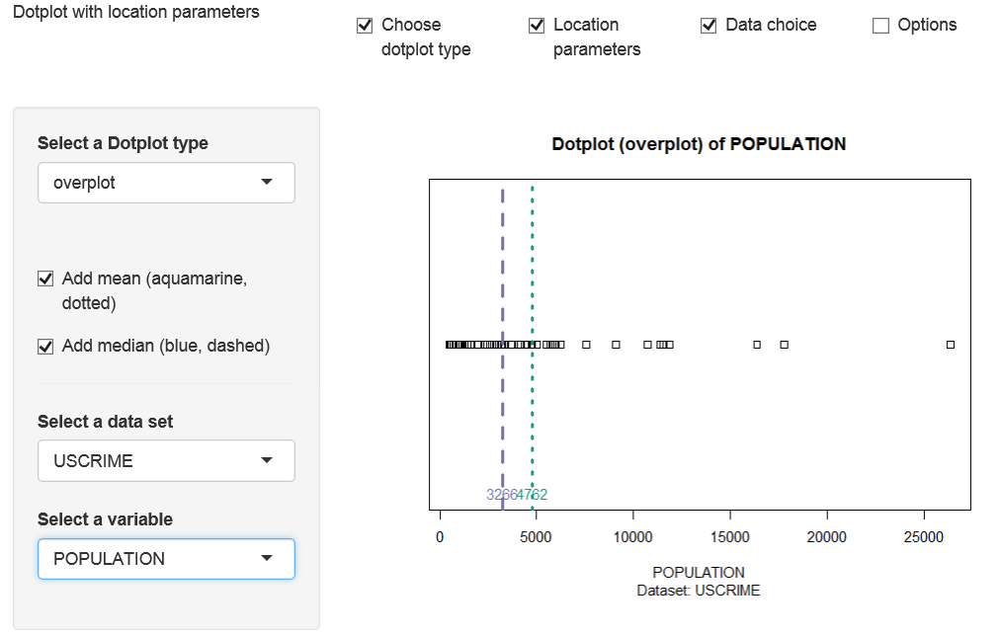

[](http://quantlet.de/index.php?p=info)

## [](http://quantlet.de/) **MMSTATdotplot_location** [](http://quantlet.de/d3/ia)

```yaml

Name of QuantLet : MMSTATdotplot_location

Published in : MMSTAT

Description : 'Shows the one dimensional dotplot in a choosable type (overplot, jitter, stack). One
can add the mean and the median to show the location parameters of one dimensional data as vertical
lines. The user can choose between variables of the CARS and USCRIME data sets.'

Keywords : 'mean, median, plot, scatterplot, quantile, visualization, data visualization,
parameter, interactive, parametric, uscrime '

See also : 'MVAbluepullover, BCS_Boxplot, BCS_Boxplot2, MVAclususcrime MMSTATtime_series_1,
MMSTATlinreg, MMSTATconfmean, MMSTATconfi_sigma, MMSTATassociation, MMSTAThelper_function'

Author : Sigbert Klinke

Code Editor : Yafei Xu

Submitted : 21/08/2015

Input : MMSTAThelper_function

Output : Interactive shiny application

Datafiles : CARS.rds, USCRIME.rds

Example : Shows the dotplot of the variable POPULATION of the data set USCRIME.

```




### R Code:
```r
# ------------------------------------------------------------------------------
# Name of Quantlet: MMSTATdotplot_location
# ------------------------------------------------------------------------------
# Published in:     MMSTAT
# ------------------------------------------------------------------------------
# Description:      Shows the one dimensional dotplot in a choosable type (overplot, jitter, stack).
#                   One can add the mean and the median to show the location parameters of one
#                   dimensional data as vertical lines.
#                   The user can choose between variables of the CARS and USCRIME data sets.
# ------------------------------------------------------------------------------
# Keywords:         mean, median, plot, scatterplot, quantile, visualization,
#                   data visualization, parameter, interactive, parametric, uscrime 
# ------------------------------------------------------------------------------
# Usage:            MMSTAThelper_function
# ------------------------------------------------------------------------------
# Output:           Interactive shiny application
# ------------------------------------------------------------------------------
# Example:          Shows the dotplot of the variable POPULATION of the 
#                   data set USCRIME.        
# ------------------------------------------------------------------------------
# See also:         MVAbluepullover, BCS_Boxplot, BCS_Boxplot2, MVAclususcrime
#                   MMSTATtime_series_1, MMSTATlinreg, MMSTATconfmean, 
#                   MMSTATconfi_sigma, MMSTATassociation, MMSTAThelper_function
# ------------------------------------------------------------------------------
# Author :          Sigbert Klinke
# ------------------------------------------------------------------------------
# Code Editor:      Yafei Xu
# ------------------------------------------------------------------------------
# Datafiles:        CARS.rds, USCRIME.rds
# ------------------------------------------------------------------------------

# please use "Esc" key to jump out of the Shiny app
rm(list = ls(all = TRUE))
graphics.off()

# please set working directory setwd('C:/...') 
# setwd('~/...')    # linux/mac os
# setwd('/Users/...') # windows

source("MMSTAThelper_function.r")

############################### SUBROUTINES ##################################
### helper function ##########################################################


mmstat.getValues = function (local, ...) {
  ret <<- list(...)
  for (name in names(ret)) {
    if (is.null(ret[[name]]) || (length(ret[[name]]) == 0)) {
      if (is.null(local[[name]])) {
        stopif (is.null(mmstat$UI[[name]]$value), 
                paste0('no default value(s) for "', name, '"'))
        ret[[name]] = mmstat$UI[[name]]$value
      } else {
        ret[[name]] = local[[name]]
      }
    }
  }
  ret
}

############################### SUBROUTINES ##################################
### server ###################################################################

mmstat$UI = list(  dataset   = list(inputId = "dataset", 
                                    label   = gettext("Select a data set"),
                                    value   = mmstat.getDatasets("CARS", 
                                                                 "USCRIME"),
                                    choices = mmstat.getDatasetNames()),
                   variable  = list(inputId = "variable", 
                                    label   = gettext("Select a variable"),
                                    value   = mmstat.getVariableNames(1)),
                   method    = list(inputId ="method", 
                                    label   = gettext("Select a Dotplot type"),
                                    choices = gettext(c("overplot", 
                                                        "jitter", 
                                                        "stack"), "name"),
                                    value   = "jitter"),
                   addmean   = list(inputId = "addmean",
                                    label   = gettext("Add mean 
                                    (aquamarine, dotted)"),
                                    value   = FALSE),
                   addmedian = list(inputId = "addmedian",
                                    label   = gettext("Add median 
                                    (blue, dashed)"),
                                    value   = FALSE),
                   cex       = list(inputId = "cex", 
                                    label   = gettext("Font size"),
                                    min     = 1,
                                    max     = 1.5,
                                    step    = 0.05,
                                    value   = 1)
            )

mmstat$vartype = 'numvars'

server = shinyServer(function(input, output, session) {
  
  output$methodUI = renderUI({
    mmstat.log('methodUI')  
    args       = mmstat$UI$method
    args$value = NULL
    do.call('selectInput', args)
  })
  
  output$addmedianUI = renderUI({
    mmstat.log('addmedianUI')
    args = mmstat$UI$addmedian
    do.call('checkboxInput', args)
  })
  
  output$addmeanUI = renderUI({
    mmstat.log('addmeanUI')
    args = mmstat$UI$addmean
    do.call('checkboxInput', args)
  })

  output$variableUI = renderUI({
    mmstat.log('variableUI')
    inp          = mmstat.getValues(NULL, dataset = input$dataset)
    args         = mmstat$UI$variable
    args$value   = NULL
    args$choices = gettext(mmstat$dataset[[inp$dataset]]$numvars, "name")
    do.call('selectInput', args)
  })
  
  output$datasetUI = renderUI({
    mmstat.log('datasetUI')
    args       = mmstat$UI$dataset
    args$value = NULL
    do.call('selectInput', args)
  })
  
  output$cexUI = renderUI({
    mmstat.log('cexUI')
    args = mmstat$UI$cex
    do.call('sliderInput', args)
  })

  getVar = reactive({
    mmstat.log(paste('getVar'))
    var         = mmstat.getVar(isolate(input$dataset), input$variable)
    var$ticks   = mmstat.ticks(var$n, nmin = 30)   
    dec         = mmstat.dec(0.1*c(0, var$sd/sqrt(max(var$ticks))))
    var$decimal = dec$decimal
    var
  })
   
  output$distPlot = renderPlot({
    mmstat.log(sprintf('distPlot %s', input$method))
    inp   = mmstat.getValues(NULL, method    = input$method,
                                   cex       = input$cex,
                                   addmean   = input$addmean,
                                   addmedian = input$addmedian
               )
    var = getVar()
    stripchart(var$values, 
               method   = inp$method, 
               main     = sprintf(gettext("Dotplot (%s) of %s"), 
                                  tolower(gettext(inp$method)), var$name), 
               xlab     = var$xlab, 
               sub      = var$sub, 
               cex.axis = inp$cex,
               cex.lab  = inp$cex,
               cex.main = 1.2*inp$cex,
               cex.sub  = inp$cex,
               axes     = F)
    usr = par("usr")
    mmstat.axis(1, usr[1:2], cex.axis = inp$cex)
    box()
    if (inp$addmean || inp$addmedian) {
      pos = mmstat.pos(usr[3:4], 0.05)
      if (inp$addmean) {
        abline(v   = var$mean, 
               lwd = 3, 
               lty = "dotted", 
               col = mmstat$col[[1]])
        text(var$mean, pos, sprintf("%.*f", var$decimal, var$mean), 
             col = mmstat$col[[1]], 
             pos = 4-var$pos,
             cex = inp$cex)
      }
      if (inp$addmedian) {
        abline(v   = var$median, 
               lwd = 3, 
               lty = "dashed",
               col = mmstat$col[[3]])
        text(var$median, pos, sprintf("%.*f", var$decimal, var$median), 
             col = mmstat$col[[3]], 
             pos = 2 + var$pos, 
             cex = inp$cex)
      }
    }
  })
  
  output$logText = renderText({
    mmstat.getLog(session)
  })
})


############################### SUBROUTINES ##################################
### ui #######################################################################

ui = shinyUI(fluidPage(
  div(class ="navbar navbar-static-top",
      div(class = "navbar-inner", 
          fluidRow(column(4, div(class = "brand pull-left", 
                                 gettext("Dotplot with location parameters"))),
                   column(2, checkboxInput("showtype", 
                                           gettext("Choose dotplot type"), TRUE)),
                   column(2, checkboxInput("showparameters", 
                                           gettext("Location parameters"), TRUE)),
                   column(2, checkboxInput("showdata", 
                                           gettext("Data choice"), FALSE)),
                   column(2, checkboxInput("showoptions", 
                                           gettext("Options"), FALSE))))),
    
  sidebarLayout(
    sidebarPanel(
      conditionalPanel(
        condition = 'input.showtype',
        uiOutput("methodUI")
      ),
      conditionalPanel(
        condition = 'input.showparameters',
        br(),
        uiOutput("addmeanUI"),
        uiOutput("addmedianUI")
      ),
      conditionalPanel(
        condition = 'input.showdata',
        hr(),
        uiOutput("datasetUI"),
        uiOutput("variableUI")
      ),
      conditionalPanel(
        condition = 'input.showoptions',
        hr(),
        uiOutput("cexUI")
      )
    ),
    
    mainPanel(plotOutput("distPlot"))),

    htmlOutput("logText")
  ))
  
############################### SUBROUTINES ##################################
### shinyApp #################################################################

shinyApp(ui = ui, server = server)

```
