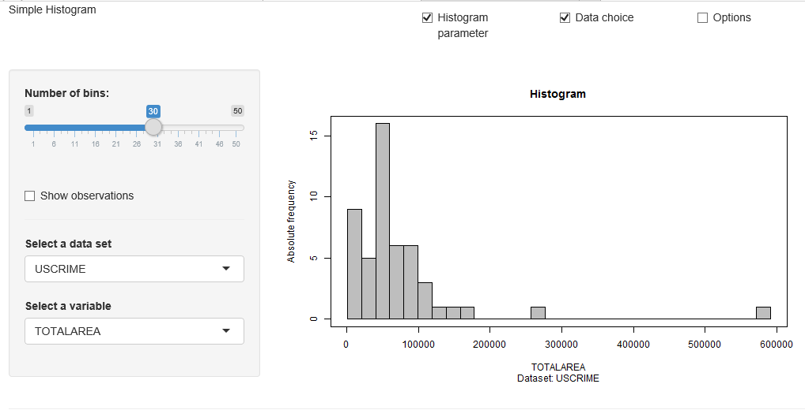

##  **MMSTAThistogram_simple**

```yaml
Name of QuantLet : MMSTAThistogram_simple

Published in : MMSTAT

Description : 'Produces an interactive interface to show the histogram. The default settings show
the histogram of the variable TOTALAREA of the USCRIME data set. The number of bins can be chosen
and there are variables of three data sets available: CARS, DECATHLON, USCRIME.'

Keywords : 'data visualization, empirical, parameter, parametric, visualization, variable
selection, frequency, histogram, uscrime'

See also : 'COPdaxnormhist, COPdaxreturnhist, BCS_Hist2, BCS_Hist1, MMSTATtime_series_1,
MMSTATlinreg, MMSTATconfmean, MMSTATconfi_sigma, MMSTATassociation, MMSTAThelper_function'

Author : Sigbert Klinke

Code Editor: Yafei Xu

Submitted : 21/08/2015

Input : MMSTAThelper_function

Output : Interactive shiny application

Datafiles : CARS.rds, DECATHLON.rds, USCRIME.rds

Example : - 'Shows a histogram of the variable TOTALAREA of the USCRIME data set. The number of
bins is set to 30.'
```




```r
# ------------------------------------------------------------------------------
# Name of Quantlet: MMSTAThistogram_simple
# ------------------------------------------------------------------------------
# Published in:     MMSTAT
# ------------------------------------------------------------------------------
# Description:      Produces an interactive interface to show the histogram. The default settings
#                   show the histogram of the variable TOTALAREA of the USCRIME data set.
#                   The number of bins can be chosen and there are variables of three data sets
#                   available: CARS, DECATHLON, USCRIME.
# ------------------------------------------------------------------------------
# Keywords:         data visualization, empirical, parameter, parametric, visualization,
#                   variable selection, frequency, histogram, uscrime
# ------------------------------------------------------------------------------
# Usage:            MMSTAThelper_function
# ------------------------------------------------------------------------------
# Output:           Interactive shiny application
# ------------------------------------------------------------------------------
# Example:          Shows a histogram of the variable TOTALAREA of the USCRIME data set.
#                   The number of bins is set to 30.
# ------------------------------------------------------------------------------
# See also:         COPdaxnormhist, COPdaxreturnhist, BCS_Hist2, BCS_Hist1,
#                   MMSTATtime_series_1, MMSTATlinreg, MMSTATconfmean, 
#                   MMSTATconfi_sigma, MMSTATassociation, MMSTAThelper_function
# ------------------------------------------------------------------------------
# Author :          Sigbert Klinke
# ------------------------------------------------------------------------------
# Code Editor:      Yafei Xu
# ------------------------------------------------------------------------------
# Datafiles:        CARS.rds, DECATHLON.rds, USCRIME.rds
# ------------------------------------------------------------------------------ 

# please use "Esc" key to jump out of the Shiny app
rm(list = ls(all = TRUE))
graphics.off()

# please set working directory setwd('C:/...') 
# setwd('~/...')    # linux/mac os
# setwd('/Users/...') # windows

source("MMSTAThelper_function.r")

############################### SUBROUTINES ##################################
### server ###################################################################

mmstat$vartype = 'numvars'

mmstat.ui.elem("bins", 'sliderInput',
               label = gettext("Number of bins:"),
               min   = 1, 
               max   = 50, 
               value = 30)
mmstat.ui.elem("obs", 'checkboxInput',
               label = gettext("Show observations"), value = FALSE)
mmstat.ui.elem("dataset", "dataSet",     
               choices = mmstat.getDataNames("USCRIME", "CARS", "DECATHLON"))
mmstat.ui.elem("variable", "variable1",   
               vartype = "numeric")
mmstat.ui.elem("cex", "fontSize")

server = shinyServer(function(input, output, session) {
  
  output$binsUI     = renderUI({ mmstat.ui.call('bins') })
  output$obsUI      = renderUI({ mmstat.ui.call('obs') })
  output$datasetUI  = renderUI({ mmstat.ui.call('dataset') })
  output$cexUI      = renderUI({ mmstat.ui.call('cex')  }) 
  output$variableUI = renderUI({ inp  = mmstat.getValues(NULL, dataset = input$dataset)
                                 mmstat.ui.call('variable',
                                                choices = mmstat.getVarNames(inp$dataset, 'numeric'))
  })   
  
  getVar = reactive({
    mmstat.log(paste('getVar'))
    var             = mmstat.getVar(isolate(input$dataset), input$variable)
    dec             = mmstat.dec(c(var$mean, var$median))
    var$decimal     = dec$decimal
    var[['pos']]    = 2*(var$mean<var$median)
    var
  })
  
  output$distPlot = renderPlot({
    var    = getVar()
    input  = mmstat.getValues(NULL, bins = input$bins, cex = input$cex, obs = input$obs)
    bins   = seq(var$min, var$max, length.out = as.numeric(input$bins) + 1)
    hist(var$values,
         breaks   = bins,
         col      = "grey", 
         xlab     = var$xlab,
         main     = gettext("Histogram"), 
         sub      = var$sub,
         ylab     = gettext("Absolute frequency"),
         cex.axis = input$cex,
         cex.lab  = input$cex,
         cex.main = 1.2*input$cex,
         cex.sub  = input$cex,
         axes     = F)
    usr = par("usr")
    mmstat.axis(1, usr[1:2], cex.axis = input$cex)
    mmstat.axis(2, usr[3:4], cex.axis = input$cex)    
    if (input$obs) rug(var$values, lwd = 1)
    box()
  })
  
  output$logText = renderText({
    mmstat.getLog(session)
  })
})

############################### SUBROUTINES ##################################
### ui #######################################################################

ui = shinyUI(fluidPage(
  div(class = "navbar navbar-static-top",
      div(class = "navbar-inner", 
          fluidRow(column(6, div(class = "brand pull-left", 
                                 gettext("Simple Histogram"))),
                   column(2, checkboxInput("showbins", 
                                           gettext("Histogram parameter"), 
                                           TRUE)),
                   column(2, checkboxInput("showdata", 
                                           gettext("Data choice"), 
                                           FALSE)),
                   column(2, checkboxInput("showoptions", 
                                           gettext("Options"), 
                                           FALSE))))),
    
  sidebarLayout(
    sidebarPanel(
      conditionalPanel(
        condition = 'input.showbins',
        uiOutput("binsUI"),
        br(),
        uiOutput("obsUI")
      ),
      conditionalPanel(
        condition = 'input.showdata',
        hr(),
        uiOutput("datasetUI"),
        uiOutput("variableUI")
      ),
      conditionalPanel(
        condition = 'input.showoptions',
        hr(),
        uiOutput("cexUI")
      )
    ),
    mainPanel(plotOutput("distPlot"))),

  htmlOutput("logText")  
))

############################### SUBROUTINES ##################################
### shinyApp #################################################################

shinyApp(ui = ui, server = server)

```
